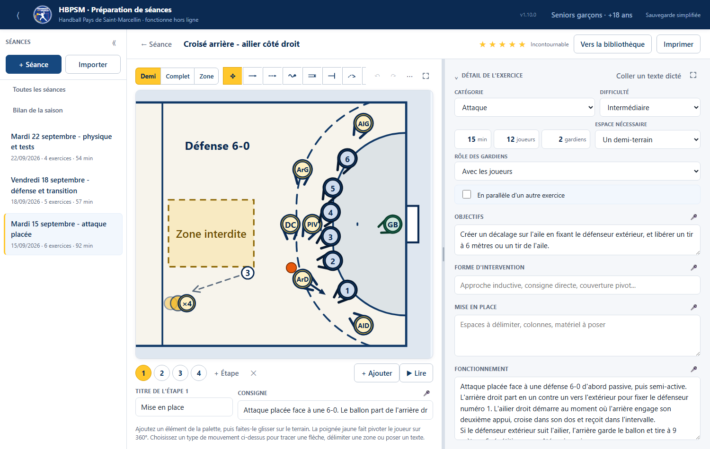
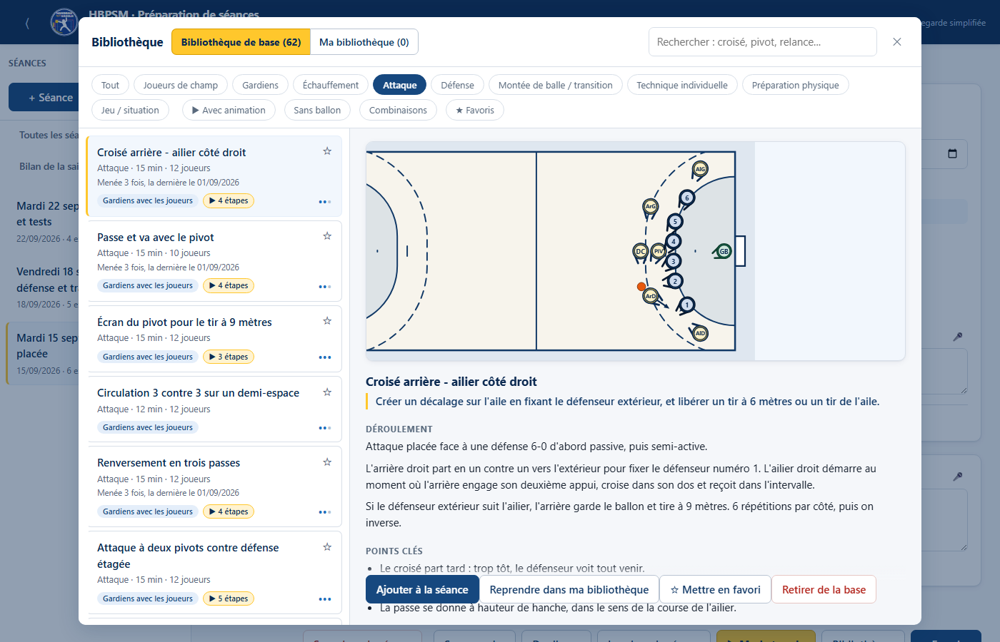
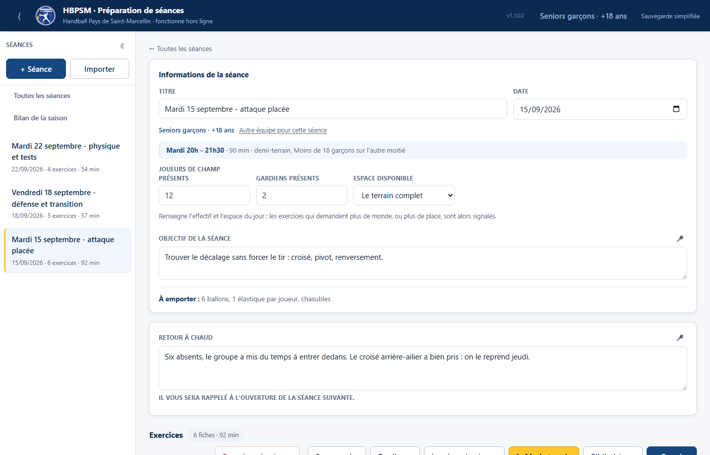

# HBPSM — Préparation de séances de handball

**Un seul fichier. Double-cliquez, l'application s'ouvre dans votre navigateur.
Pas d'installation, pas de compte, pas de connexion.**

Écrit pour les entraîneurs du Handball Pays de Saint-Marcellin, et utilisable
par n'importe quel club : préparer une séance, la dessiner, l'imprimer, la mener
au gymnase, et se souvenir de ce qui a marché.

[**→ Télécharger la dernière version**](../../releases/latest)



## Pourquoi celui-ci plutôt qu'un autre

- **62 exercices sont déjà écrits.** Échauffement, attaque, défense, montée de
  balle, gardiens, préparation physique — avec objectifs, points clés et
  variantes. Vous en prenez un, vous l'ajustez ; l'original reste intact.
- **Le terrain est aux cotes officielles.** Vous posez les joueurs, vous tirez
  une flèche, la position suivante en découle. Le mouvement se rejoue en
  animation et s'imprime à n'importe quelle taille sans se déformer.
- **Ça fonctionne au gymnase.** Sans réseau, sans batterie de serveur : une
  feuille par exercice à emporter, ou le mode terrain sur un téléphone posé sur
  le banc.
- **Ce que vous notez vous revient.** Le mot écrit après l'entraînement remonte
  en haut de la séance suivante. C'est ce qui distingue l'application d'un
  carnet.
- **Vos données sont à vous.** Rien ne part nulle part. Tout vit dans votre
  navigateur, et un fichier `.hbt.json` emporte l'ensemble d'un ordinateur à
  l'autre.



## Prendre en main en dix minutes

Le fichier **PRISE-EN-MAIN.html**, livré à côté de l'application dans chaque
[release](../../releases/latest), conduit un entraîneur de la première ouverture
à sa première séance imprimée. C'est le seul document, et il est illustré de
captures prises dans l'application elle-même.



## Ce qu'il ne fait pas

Pas de gestion de licences, de convocations ni de feuilles de match. Pas de
statistiques de match. Pas de partage en ligne : une séance s'échange en
envoyant un fichier. C'est un outil de préparation d'entraînement, et rien
d'autre.

## Contribuer

Le projet est en TypeScript et React, sans dépendance à l'exécution : le
livrable est un seul fichier HTML autonome, produit par Vite.

```
npm install
npm run dev          # serveur de developpement
npm run verifier     # fabrication + tests + tests de fumee
```

`npm run build` enchaîne le typage, le bundle en fichier unique, puis la
fabrication de la prise en main — captures comprises, prises en pilotant le
livrable lui-même.

**La suite de tests compte plus de mille assertions** et tourne à chaque
poussée. Le domaine est pur — aucun React, aucun DOM — et se teste sans
navigateur ; ce qui ne peut se vérifier que dans un vrai navigateur (mise en
page imprimée, animation, champs contrôlés) a ses propres tests, pilotés par le
protocole DevTools.

### Ce qui structure le code

- **Les coordonnées du terrain sont en mètres**, jamais en pixels : un schéma
  change de vue et s'imprime à n'importe quelle taille sans se déformer.
- **Les jetons sont persistants entre les étapes** : une étape ne stocke que les
  nouvelles positions, ce qui rend le mouvement traçable et animable.
- **Les fiches fournies portent une référence stable**, indépendante de leur
  titre, pour que rien de ce qui s'y accroche ne se perde à un renommage.
- **Ce qui appartient à l'entraîneur est rangé à part des séances** : son équipe,
  ses favoris, les fiches qu'il a retirées. Ce sont des préférences, pas des
  données de séance.
- **Une alerte qui parle pour ne rien dire n'est plus lue.** Le rappel de
  sauvegarde se tait tant que rien n'a changé : il ne se dépense que là où il y
  a vraiment quelque chose à perdre.
- **Les automatismes pré-remplissent, ils ne décident pas.** Le planning, le
  titre par défaut, l'orientation d'un joueur : chacun se corrige à la main, et
  ce qui a été saisi n'est jamais écrasé.
- **La documentation est engendrée, jamais recopiée.** Les nombres cités et les
  captures viennent du code et du livrable ; des tests refusent la fabrication
  quand ils divergent.
- **Un club tient dans un dossier.** Le nom, l'écusson et les fiches propres à
  un club vivent dans `clubs/<identifiant>/` ; le code, lui, ne nomme jamais de
  club. Un test refuse qu'un nom de club réapparaisse ailleurs.

## Un club, un exemplaire

L'application est la même pour tous ; ce qui change d'un club à l'autre tient
dans son profil :

| Fichier | Ce qu'il porte |
| --- | --- |
| `profil.json` | Identifiant, nom court, nom complet, nom du fichier livré |
| `Ecusson.tsx` | L'écusson du club |
| `fiches.ts` | Ses séances propres, ajoutées au fonds commun — vide pour la plupart des clubs |

```
npm run build            # le club par defaut du depot
CLUB=xxx npm run build   # l exemplaire du club xxx
```

Ouvrir un club, c'est copier un dossier de `clubs/` et en changer le contenu :
aucun fichier de `src/` n'est touché. Le fonds commun des exercices part avec
tous les exemplaires ; les fiches d'un club ne partent qu'avec le sien.

Le détail de ces choix, et les raisons derrière, sont dans les commentaires du
code : ce sont eux la référence du projet.

## Licence

Voir [LICENSE](LICENSE).
